<div align="center">

# 🪶 Plume

**Le SOC / XDR souverain, léger comme une plume** — des opérations de sécurité sans la pile lourde.
*Rust · SQLite · un seul petit binaire · tourne dans 2 Go · on‑premise, respectueux du RGPD, zéro dépendance externe.*

**·  open source  ·  par [GuatX](https://github.com/guatxlabs)  ·**

**Licence : [AGPL‑3.0](LICENSE)**  ·  Modules Enterprise → [`COMMUNITY_VS_ENTERPRISE.md`](COMMUNITY_VS_ENTERPRISE.md)

</div>

<p align="center">
  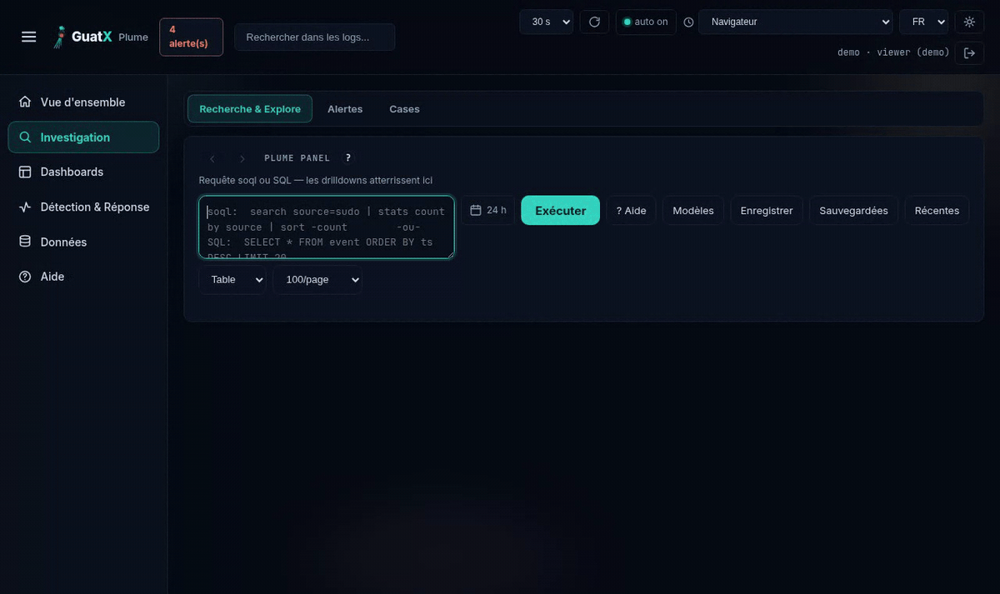
</p>

Plume est la **moitié bleue d'un SOC purple**. Il ingère **logs et métriques**, puis vous offre la **recherche
(GXQL)**, des **tableaux de bord**, un **moteur de détection** (règles · import Sigma · couverture ATT&CK · playbooks
SOAR‑lite), du **threat‑intel** (correspondance IOC/STIX/TAXII à l'ingestion), de l'**alerting basé sur le risque**, des **cases
d'incident** et une **réponse automatisée** — le tout dans **un seul petit binaire** que vous exécutez
sur **Docker**, un **hôte nu (systemd)** ou **Kubernetes/k3s**, dans **2 Go de RAM**.

> ### 🔴🔵 La boucle purple — un SOC qui s'entraîne face à son propre attaquant
> Plume fait équipe avec **[Forge](https://github.com/guatxlabs/forge)**, le moteur red‑team. **Forge lance** un
> engagement autorisé → **Plume détecte et corrèle** chaque action par sa technique ATT&CK → la **matrice de
> couverture** transforme chaque manqué en un angle mort visible à combler. Le **Mode Engagement** natif permet à un
> pentest autorisé de se dérouler à travers le SOC en production **sans reconfiguration** (le mode s'active et se désactive
> à chaud, mode‑off prouvé byte‑identique par les tests), puis
> nettoie automatiquement et produit un rapport signé.
>
> *La boucle attaque → SIEM → validation de détection **existe ailleurs** : [Splunk Attack Range](https://github.com/splunk/attack_range)
> (OSS, Splunk Threat Research Team) l'automatise jusqu'en CI/CD, [MITRE Caldera](https://github.com/mitre/caldera)
> l'outille côté adversaire, et le marché BAS/AEV (Cymulate, SafeBreach, Picus) la vend. Ce que **nous** n'avons trouvé
> chez personne, c'est cette boucle livrée **dans une suite souveraine, auto‑hébergée, dont la moitié bleue tient dans 2 Go** —
> rouge et bleu de la même suite (deux dépôts, [Plume](https://github.com/guatxlabs/plume) et
> [Forge](https://github.com/guatxlabs/forge)), corrélés par technique ATT&CK, sans SaaS ni cluster. Si vous connaissez un contre‑exemple,
> [ouvrez une issue](https://github.com/guatxlabs/plume/issues) : nous corrigerons cette phrase.*

### Pourquoi Plume
- 🪶 **Léger et souverain** — un seul binaire Rust (`axum` + `rusqlite`/SQLite, WAL+FTS5) + une PWA en JavaScript vanilla sans build. **Mesuré : de l'ordre de trois cents Mio de RSS** sur le profil de référence (**près de dix millions d'événements en base, 2 vCPU, plafond 2 Gio, masquage inactif**) ; un `count` sur toute cette base rend en quelques secondes sous ce plafond. Le plafond de 2 Gio est **appliqué à l'exécution, pas vérifié par la CI** — mesurez votre propre empreinte. Pas de cloud américain, pas de cluster à opérer.
- 🧩 **Bring‑your‑own‑vendor** — *rien de spécifique à un éditeur n'est codé en dur.* Branchez **n'importe quelle** source : un **DSL de parsing** déclaratif (config.d, sans rebuild), un endpoint **compatible Splunk‑HEC** (pointez vos forwarders existants vers Plume), un **connecteur `http_pull` générique** (n'importe quelle API REST — CrowdStrike/SentinelOne/Defender par simple configuration), ou des flux **TAXII 2.1**. *Objectif de conception : ne pas vous faire perdre de capacité en migrant. Ce n'est pas une garantie mesurée — aucune matrice comparative n'existe dans `docs/` ; si une capacité vous manque, [ouvrez une issue](https://github.com/guatxlabs/plume/issues).*
- 🛡️ **Une détection qui grandit avec vous** — l'**import Sigma** (unitaire et en masse) projette le jeu de règles communautaire sur la **matrice de couverture ATT&CK** ; le **threat‑intel** enrichit à l'ingestion ; l'**alerting basé sur le risque** score les entités pour réduire la fatigue d'alertes. Normalisé CIM, pour que les règles se composent par *catégorie*, jamais par éditeur.
- 🔐 **Sécurisé et auditable par défaut** — argon2id + RBAC **fail‑closed** (une route non listée est refusée, pas autorisée), tokens d'agent liés à l'hôte, requêtes validées en lecture seule, un **ledger en chaîne de hachage** vérifiable (`plume-daemon verify`), conteneur durci (non‑root, rootfs en lecture seule, capabilities supprimées) et une **NetworkPolicy d'egress default‑deny** livrée dans [`deploy/k3s.yaml`](deploy/k3s.yaml). **Aucun secret dans le dépôt** — un code ouvert est une *fonctionnalité*, pas un risque.
  *Deux réserves explicites, parce qu'un défaut annoncé vaut mieux qu'un défaut découvert :* le **chiffrement at‑rest SQLCipher** (par tenant en mode MSSP) est **compilé mais OPT‑IN** — sans clé (`PLUME_DB_KEY_FILE`), **la base est en clair sur le disque** ; et la NetworkPolicy n'a d'effet que si votre CNI les applique (flannel seul ne le fait pas — [vérifiez‑le](deploy/k3s.yaml), ne le supposez pas).
- 🌍 **Interface bilingue** (FR / EN) + tous les fuseaux horaires IANA.

**Architecture** — *Central* : un seul binaire Rust qui ingère, stocke et sert l'API + la PWA sur `:7000`.
*Agents* : des collecteurs `sh` + `systemd` sans dépendances (plugins, désactivés par défaut) qui poussent vers le central
(`POST /api/ingest`, token bearer) ; un agent endpoint multi‑OS (Linux aujourd'hui, Windows/macOS en cours).
Le central est aussi son propre agent. Documentation approfondie : [`ARCHITECTURE.md`](ARCHITECTURE.md) ·
**[index de la documentation](docs/README.md)** (chaque document y porte son état : livré / opt-in /
conception) — dont [SDK](docs/SDK.md) · [CIM](docs/CIM.md) · [DSL de parsing](docs/PARSER-DSL.md) ·
[Importeur Sigma](docs/SIGMA-IMPORTER.md) · [reprise après sinistre](docs/DR-plume-restore.md).

**Pour s'en servir**, quatre pages écrites pour l'exploitant plutôt que pour le contributeur :
[le même geste dans les trois modes](docs/TROIS-MODES.md) ·
[la console, onglet par onglet](docs/CONSOLE.md) ·
[le langage de recherche GXQL](docs/GXQL.md) ·
[les agents et leur protocole](docs/AGENTS-PROTOCOLE.md) ·
[chiffrement et compression, tels qu'ils sont](docs/CHIFFREMENT-COMPRESSION.md).

## Au menu
| Domaine | Capacité |
|---|---|
| **Recherche** | GXQL (*GuatX Query Language*, **anciennement « SOQL »** — même langage, même syntaxe, seul le nom change) — un langage à pipes façon SPL compilé en SQL **lecture seule, à l'épreuve des injections** : colonnes en liste blanche, identifiants contraints en forme, **littéraux échappés** (le chemin GXQL n'utilise pas de paramètres liés — ils sont sur `/api/search`), une seule instruction préparée, budget temps. Grammaire complète, bornes et **ce que le langage n'accepte pas** : **[`docs/GXQL.md`](docs/GXQL.md)**. Aucune requête, aucun panneau, aucune règle n'est à réécrire ; les identifiants techniques (route `/api/soql/*`, clé JSON `soql`, colonne `is_soql`, module Rust `guatx_core::soql`) restent en `soql`. |
| **Détection** | Règles + playbooks SOAR‑lite · **import Sigma** (unitaire et en masse, avec delta de couverture ATT&CK) · **matrice de couverture ATT&CK** (**14 tactiques × 183 techniques** curées — le catalogue `guatx_core::attack::CATALOG`, angles morts mis en évidence). |
| **Threat‑intel** | Base d'IOC · import **STIX 2.1** · **correspondance à l'ingestion** (`ti_match`, enrichir sans supprimer) · connecteur de flux **TAXII 2.1** · appartenance basée sur des filtres de Bloom pour le passage à l'échelle. |
| **Risque (RBA)** | Scoring de risque par entité (modèle Splunk‑ES) · alerting sur incident de risque (cumul / tactiques distinctes / vélocité) · une seule alerte dédupliquée par entité. |
| **Ingestion** | Agents (sh/systemd) · endpoint compatible fil **Splunk HEC** · connecteur **`http_pull` générique** (bring‑your‑own‑vendor) · parser syslog + Fortinet · DSL de parsing déclaratif. |
| **Réponse** | **Vocabulaire d'actions fermé et à l'épreuve des injections** (ban_ip / unban_ip / kill_pid / stop_service) avec **exécuteurs par plateforme** (nft/fail2ban/netsh/pfctl/appliance) — dry‑run + approbation + liste blanche + ledger. |
| **Cases** | Cases d'incident, triage à l'échelle, export. |
| **Multi‑tenant** | Mode MSSP optionnel — chiffrement **SQLCipher par tenant**, groupes RBAC → tenant/rôle, super‑admin audité. *(Désactivé par défaut — le mono‑tenant est identique au bit près.)* |
| **Purple** | **Mode Engagement** (pentest autorisé à travers le SOC en production, sans angle mort, auto‑nettoyage, rapport signé) — la jonction avec [Forge](https://github.com/guatxlabs/forge). |

## Captures d'écran

**La boucle, en quatre images** — un tableau de bord pose la question, une requête y répond, un clic descend
à l'événement, un pipeline regex transforme la réponse en agrégat. Données 100 % synthétiques (instance de
démo, adresses RFC 5737).

<table>
<tr>
<td width="50%"><a href="docs/img/30-dashboards-live.png">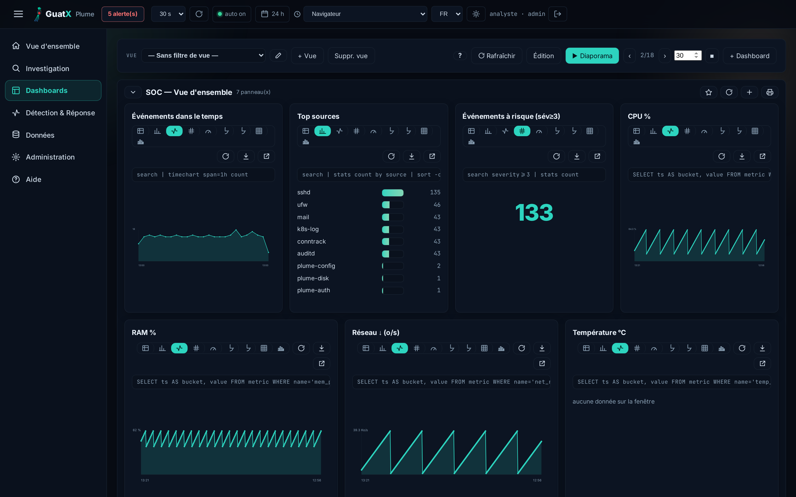</a><br><sub><b>Tableaux de bord vivants</b> — et <b>chaque panneau affiche la requête qui le produit</b> : un graphique n'est jamais une boîte noire</sub></td>
<td width="50%"><a href="docs/img/31-recherche-gxql-resultats.png">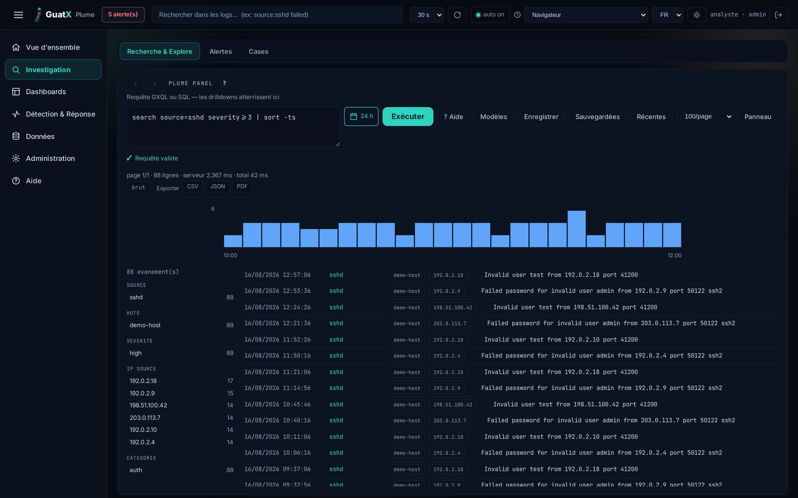</a><br><sub><b>Recherche GXQL → résultats</b> — validation live, <b>88 lignes en 0,66 ms serveur</b>, histogramme temporel et facettes de champs (source, hôte, sévérité, IP) ; export CSV/JSON/PDF</sub></td>
</tr>
<tr>
<td><a href="docs/img/32-evenement-detaille.png">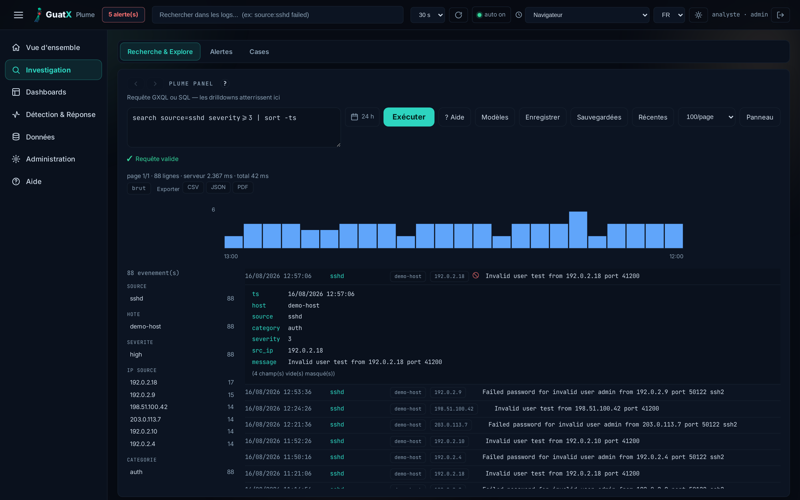</a><br><sub><b>Un clic sur un résultat</b> déplie l'événement entier — tous les champs, y compris le décompte de ceux qui sont vides</sub></td>
<td><a href="docs/img/33-regex-rex-agregat.png">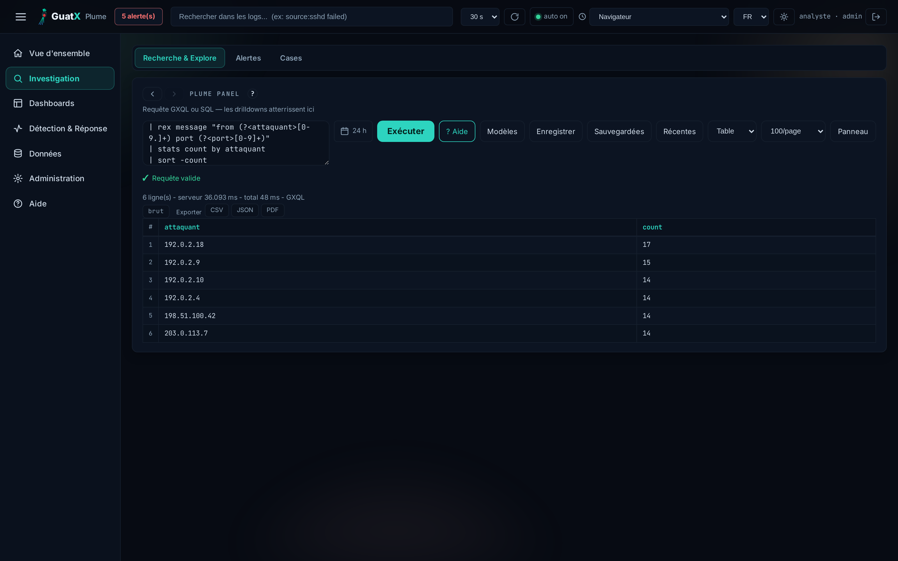</a><br><sub><b>Pipeline à extraction regex</b> — <code>rex</code> nomme des groupes dans le message, puis <code>stats</code>/<code>sort</code> agrègent : les IP attaquantes sortent classées</sub></td>
</tr>
</table>

<table>
<tr>
<td width="50%"><a href="docs/img/06-dashboard-light.png">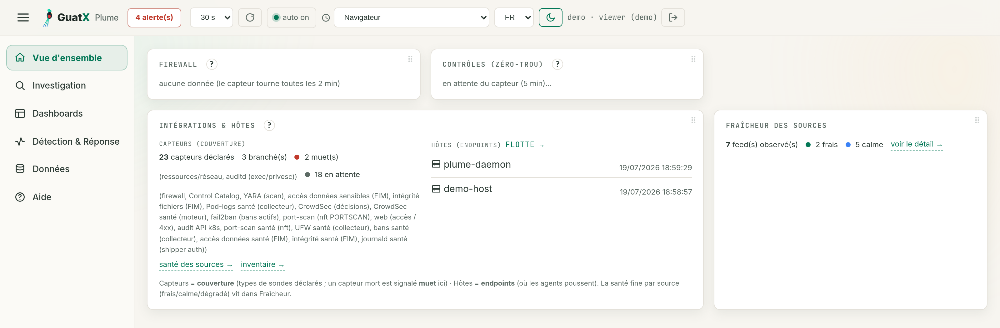</a><br><sub><b>Vue d'ensemble</b> — firewall, contrôles, hôtes et fraîcheur des sources</sub></td>
<td width="50%"><a href="docs/img/03-explore-gxql.png">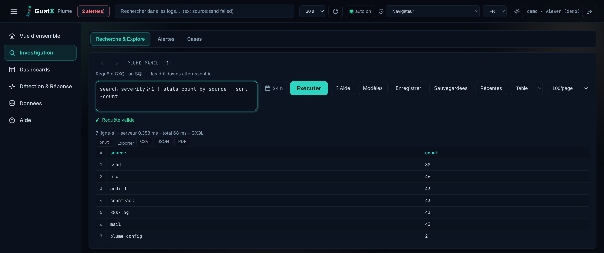</a><br><sub><b>Explore / GXQL</b> — recherche façon SPL compilée en SQL sûr, en lecture seule</sub></td>
</tr>
<tr>
<td><a href="docs/img/08-case-detail.png">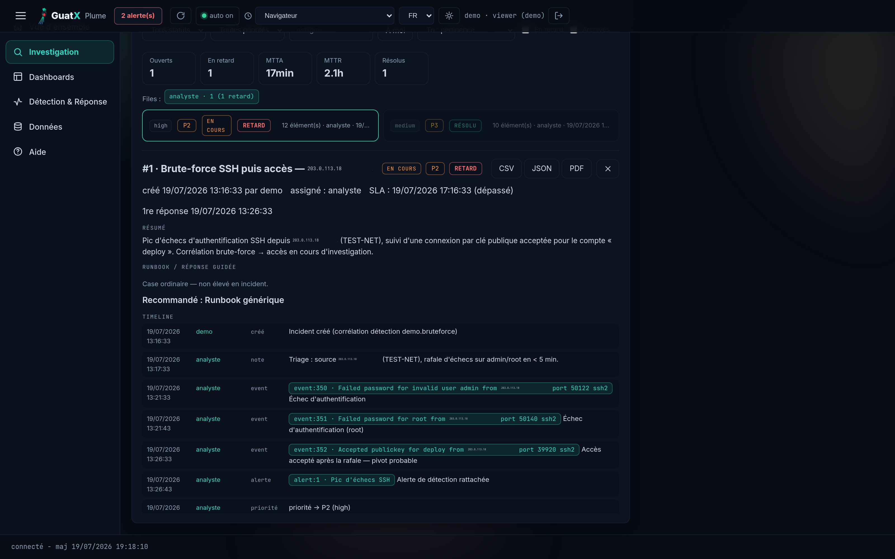</a><br><sub><b>Cases d'incident</b> — timeline, événements/alertes liés, SLA</sub></td>
<td><a href="docs/img/04-attack-matrix.png">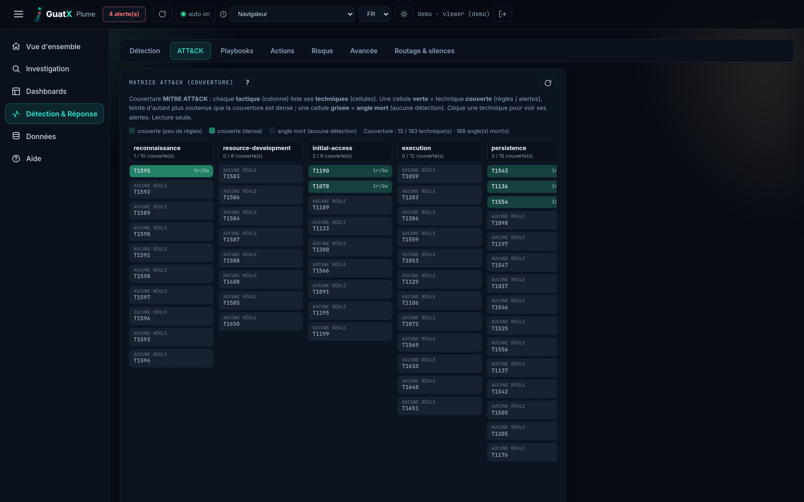</a><br><sub><b>Couverture ATT&CK</b> — chaque manqué devient un angle mort visible</sub></td>
</tr>
<tr>
<td><a href="docs/img/10-inventaire-sources.png">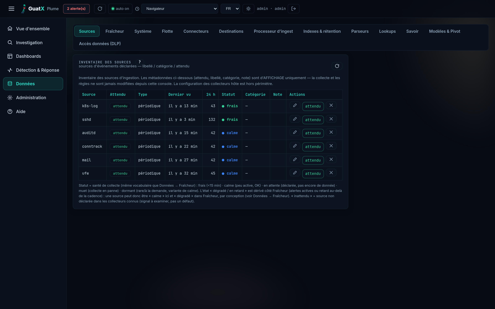</a><br><sub><b>Inventaire des sources</b> — flux déclarés, attendu vs réel, fraîcheur</sub></td>
<td><a href="docs/img/21-admin-audit.png">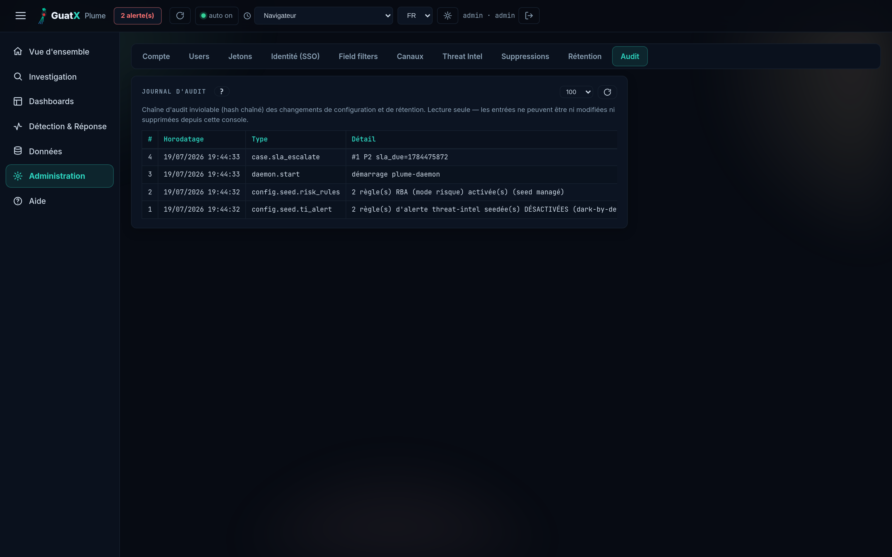</a><br><sub><b>Administration</b> — ledger d'audit en chaîne de hachage, vérifiable</sub></td>
</tr>
</table>

## Installation

Le mot de passe admin n'est **jamais** stocké en clair : vous fournissez son **hash argon2id** via
`PLUME_PASS_HASH` (généré par la commande `hashpw`). En son absence, le central démarre en **mode SETUP**
(un token d'installation à usage unique affiché dans les logs → assistant web).

> ### ⚠️ À lire avant de choisir un mode : rien n'est encore pré‑construit
> **Aucune image de conteneur et aucun binaire ne sont publiés à ce jour** (pas de `ghcr.io/...`, pas
> d'artefact de release). Les trois modes **compilent le daemon depuis les sources**. Concrètement :
> - **Docker** ne demande **pas** de toolchain Rust sur votre machine : le `Dockerfile` compile dans un
>   stage `rust:1-bookworm`. Docker (avec BuildKit) suffit.
> - **Hôte nu** et **k3s** demandent, eux, **un Rust stable installé** (`cargo`) : le premier pour
>   produire le binaire, le second pour produire l'image à importer.
> - Le build tire crates.io **et** la git‑dep `guatxlabs/core`, à l'étiquette **épinglée dans
>   [`daemon/Cargo.toml`](daemon/Cargo.toml)** (`grep guatx-core daemon/Cargo.toml` — la citer ici la
>   ferait vieillir, et c'est déjà arrivé) → **un accès réseau est requis**
>   au premier build. *Durée et pic mémoire du build : non mesurés sur cette machine ; le `Dockerfile`
>   borne `CARGO_BUILD_JOBS=2` pour éviter l'OOM sur une petite machine.*
>
> Publier une image et des binaires signés est le **prérequis n°1** pour un démarrage « sans toolchain » ;
> c'est un manque assumé et connu, pas un oubli.

### A. Docker (le plus simple)
Depuis la racine de ce dépôt (le contexte de build est le dépôt lui‑même ; `guatx-core` est résolu
via une git‑dep publique, aucun crate sibling requis) :
```sh
cp .env.example .env
docker compose build soc                             # 1er coup : long (compile le daemon), réseau requis
# le hash s'écrit dans .env ENTRE APOSTROPHES SIMPLES — la ligne ci-dessous s'en charge :
docker compose run --rm -T soc hashpw 'my-password' | grep -a '^[$]argon2id[$]' | sed "s/.*/PLUME_PASS_HASH='&'/" >> .env
tail -n 1 .env                                       # DOIT afficher PLUME_PASS_HASH='$argon2id$…'
docker compose up -d --build                         # -> http://soc.localhost:7000
```

> ### ⚠️ Le hash se colle **entre apostrophes simples**, et la construction se fait **à part**
> **Construisez d'abord.** Aucune image n'est publiée : sur un clone neuf, `run` **construit**, et
> BuildKit écrit son journal sur la **sortie standard** — donc dans le tube, donc dans `.env`.
> *Mesuré au banc le 2026‑08‑29 :* une cinquantaine de lignes parasites, dont une qui recopie une
> ligne du `Dockerfile` portant des apostrophes ; `.env` devient **illisible** et Compose refuse
> alors **toutes** ses sous‑commandes, `down` compris — on ne peut même plus nettoyer. `build`
> d'abord laisse ce journal à l'écran, où il se lit.
>
> **Le `grep` est la seconde ceinture**, et sa forme est dérivée de ce qu'on veut : un hash argon2id
> commence par `$argon2id$`, une ligne de journal jamais (BuildKit préfixe les siennes par `#<n>`).
> Si la construction échoue, **rien** ne passe le filtre : `.env` reste intact et le **mode SETUP**
> s'arme — bruyant, plutôt qu'un hash silencieusement faux. *`tail -n 1` ne suffirait pas :* sur une
> construction échouée, la dernière ligne est un séparateur BuildKit, qui deviendrait le hash.
>
> **La ligne ajoutée gagne.** Elle arrive **après** la ligne `PLUME_PASS_HASH=` vide héritée de
> `.env.example`, et dans un `.env` **c'est la dernière écrite qui gagne** *(mesuré)*. Si vous
> préférez copier‑coller à la main, **remplacez** cette ligne vide — ou écrivez la vôtre **plus
> bas** — et donnez‑lui **exactement** cette forme, apostrophes comprises :
> ```
> PLUME_PASS_HASH='$argon2id$v=19$m=19456,t=2,p=1$<sel>$<empreinte>'
> ```
> **Pourquoi.** Un hash argon2id porte **cinq `$`**, et Compose les lit dans `.env` comme des
> ouvertures de **variable** : `$argon2id`, `$v`, `$m`, puis le sel et l'empreinte quand ils
> commencent par une lettre. Chacun est remplacé par une chaîne vide — Compose l'annonce en
> `… variable is not set`, un avertissement qu'on lit rarement — et **ce qui atteint le conteneur
> n'est plus le hash**. La forme **nue** et la forme entre **guillemets doubles** donnent le *même*
> résultat amputé ; seules les **apostrophes simples** (qui coupent l'interpolation) ou des `$`
> **doublés** passent la valeur intacte.
>
> **La règle vaut pour toute valeur de `.env`**, et la plus coûteuse n'est pas le hash : c'est
> **`PLUME_DB_KEY`**. *Mesuré au banc le 2026‑08‑29 :* une passphrase `Correct$Horse$Battery9`
> écrite nue atteint le conteneur comme `Correct`, et `$secret$phrase` l'atteint **vide** — donc
> « aucune clé », donc une base neuve qui **naît sous une clé engendrée** que personne n'a choisie,
> pendant que la passphrase mise à l'abri n'ouvre rien. Un hash amputé se répare ; cela, non.
>
> **Le `-T`, dit exactement.** *Mesuré au banc le 2026‑08‑29 sur Compose 5.5.0 :* l'allocation d'un
> terminal suit la **sortie** — un tube n'en alloue pas, et la valeur se termine par un saut de
> ligne seul, avec ou sans `-T`. Quand un terminal **est** alloué (sortie à l'écran), la ligne se
> termine bien par un **retour chariot**, qui entrerait dans la valeur si elle était capturée
> autrement. `-T` rend donc cette absence **explicite** au lieu de la faire dépendre d'une détection
> qui n'est pas un contrat.
>
> **Ce qui arrive alors n'est pas une valeur vide — c'est pire.** *Mesuré le 2026‑08‑29 sur des hash
> produits par `hashpw` lui‑même :* la valeur reçue est **partielle**, jamais vide, jamais intacte, et
> sa longueur varie avec le sel. Le **mode SETUP** n'est donc **pas** armé (il exige une valeur *vide*) :
> le daemon démarre avec un hash qui ne peut vérifier aucun mot de passe et **personne n'entre** — ni
> par mot de passe, ni par l'assistant, sans bannière ni ligne rouge. Ce n'est pas une installation
> ouverte, c'est un **verrouillage muet** ; le remède est de réécrire `.env` avec les apostrophes.
> *Ce piège est propre à Compose : en k3s le hash va dans un `Secret`, que `kubectl` n'interpole pas.*

> ### ⚠️ Le conteneur est **borné** — et l'adoption du plafond se mesure avant
> Le `docker-compose.yml` pose désormais les quatre bornes du mode conteneur (mémoire,
> mémoire+échange, processeur, processus) plus la **taille du `/tmp`** — un tmpfs sans taille est de
> la RAM comptée au même cgroup, donc un contournement des trois premières. Les cinq se règlent par
> `.env` (`PLUME_MEM_LIMIT`, `PLUME_CPUS`, `PLUME_PIDS_LIMIT`, `PLUME_TMP_SIZE`) : personne n'a à
> éditer un fichier suivi pour changer un chiffre. **Sur un déploiement déjà en service**, relevez
> d'abord, plusieurs fois et sous charge, la part que rien ne récupère quand l'échange est à zéro —
> `docker compose exec soc sh -c 'grep "^anon " /sys/fs/cgroup/memory.stat'` — et montez
> `PLUME_MEM_LIMIT` si elle approche le plafond : le dépassement n'est pas une lenteur, c'est un
> OOM‑kill que `restart: unless-stopped` transforme en boucle.

Le `docker-compose.yml` livré **arme** les ops natives du binaire : planificateur de sauvegarde
toutes les 6 h vers `/data/backups` (rétention des 24 plus récents) + **auto‑vacuum quotidien**, sans
sidecar ni cron hôte. Réglez‑les — ou coupez‑les avec `PLUME_BACKUP_INTERVAL=0` — via `.env`.

> ⚠️ **Armer le planificateur ne suffit pas à obtenir une sauvegarde.** *Mesuré sur l'arbre suivi le
> 2026‑08‑25 :* le chemin compressé **exige `PLUME_DB_KEY`** (la clé sert de passphrase à l'enveloppe),
> et cette clé est **vide par défaut**. Sur une installation Docker ou k3s prise telle quelle, chaque
> cycle échoue en journalisant `backup --compress : PLUME_DB_KEY requis` et **aucune archive n'est
> produite** — le planificateur continue, aucun voyant ne change. Le mode hôte n'a pas ce trou : son
> timer emprunte `VACUUM INTO`, qui n'exige aucune clé. Posez une clé, puis **prouvez‑le** avec
> `plume-daemon backup-verify`. Détail complet :
> [`docs/CHIFFREMENT-COMPRESSION.md`](docs/CHIFFREMENT-COMPRESSION.md#34-le-défaut-mesuré--sans-clé-de-base-le-planificateur-ne-produit-rien).

> 🪶 **Démo (peuplée, sans agents)** — ajoutez `PLUME_DEMO=1` : des événements/métriques/alertes d'exemple sur 24 h pour voir Plume *vivant* immédiatement. *(Désactivé hors démo.)*

### B. Hôte nu (systemd) — mode de première classe, sans Docker
```sh
cd daemon && cargo build --release && cd ..          # single-file binary (Rust stable requis)
sudo bash bootstrap.sh                               # central: daemon + units, :7000 (idempotent)
```
`bootstrap.sh` **refuse de continuer** si `daemon/target/release/plume-daemon` est absent : compilez d'abord.
Il installe le daemon, les collecteurs et leurs units/timers — dont **`plume-backup.timer` (quotidien,
04:00)**, qui appelle `plume-daemon backup` (copie compacte `VACUUM INTO`, rotation à 7). *Ce chemin hôte
diffère de celui du mode Docker/k3s* : le timer produit une copie `.db` non compressée, le scheduler
in‑daemon produit une archive `age(zstd(...))` — voir [`docs/DR-plume-restore.md`](docs/DR-plume-restore.md).
Pour aligner l'hôte sur le scheduler natif, posez `PLUME_BACKUP_INTERVAL` dans `/etc/plume/soc.conf` et
désactivez le timer (`systemctl disable --now plume-backup.timer`). **Tous** les réglages `PLUME_BACKUP_*`
— dont le destinataire d'escrow `PLUME_BACKUP_AGE_RECIPIENT` et le fail-closed
`PLUME_BACKUP_REQUIRE_ASYMMETRIC` — se lisent depuis ce même fichier (précédence `env > soc.conf > défaut`,
identique dans les trois modes de déploiement). *Ce n'était pas vrai avant le 2026-08-09 : ces deux-là
étaient lues dans l'environnement seul, donc ignorées en silence sur un hôte — cf. P8.7-a dans
[`docs/ROADMAP.md`](docs/ROADMAP.md).*

Enrôlez une autre machine comme agent qui pousse vers le central :
```sh
sudo /usr/local/bin/plume-daemon token agent-$(hostname) $(hostname)   # on the central — 2e arg = l'hôte LIÉ
# (un forwarder multi-hôtes se déclare : `plume-daemon token <nom> --relais` ; la forme à 2 arguments est refusée)
# on the agent — le token passe par STDIN, JAMAIS par la ligne de commande (voir l'avertissement) :
umask 077
printf 'PLUME_CENTRAL=%s\nPLUME_TOKEN=%s\n' 'https://central:7000' '<token>' \
  | sudo tee /etc/plume/plume.conf >/dev/null
sudo chgrp soc /etc/plume/plume.conf && sudo chmod 0640 /etc/plume/plume.conf
sudo bash bootstrap-agent.sh          # conf déjà présente -> conservée telle quelle
```

> ### ⚠️ Ne passez JAMAIS le token sur la ligne de commande
> La forme `sudo env PLUME_TOKEN='<token>' bash bootstrap-agent.sh` **fuite le token dans le SOC
> lui‑même**. `sudo` journalise sa ligne de commande complète (`COMMAND=…`) ; le collecteur `journal`
> expédie ces entrées vers `/api/ingest/journal`, et le daemon les stocke **en clair** dans
> `event.message` **et** `event.fields.command`. *Mesuré le 2026‑08‑01 sur Ubuntu 24.04.4 amd64 : la
> commande d'enrôlement documentée jusqu'ici produisait 6 events contenant le token en clair ; la
> variante `tee` ci‑dessus en produit 0, agent fonctionnel à l'identique.* Tout **viewer** du SOC peut
> alors lire le token (`search source=sudo`) et s'en servir pour injecter des events, usurper un hôte
> via HEC/OTLP, ou réclamer une action de réponse non assignée.
> Le collecteur `journal` remonte jusqu'à **15 min en arrière** à son premier run : l'activer *après*
> l'enrôlement ne protège pas. Si la fuite a déjà eu lieu : **révoquez et recréez le token**, puis
> purgez les events concernés.

### C. Kubernetes / k3s
**[`deploy/k3s.yaml`](deploy/k3s.yaml)** est complet et applicable tel quel : **Namespace + Secret + PVC +
Deployment + Service + Ingress + NetworkPolicy** (egress *default‑deny*, DNS seul autorisé) — avec le
backup natif activé. Remplacez les valeurs à compléter (`PLUME_PASS_HASH`, et `soc.tondomaine.tld` **aux
deux endroits** : `PLUME_HOST` et l'Ingress — un écart déclenche la garde anti‑DNS‑rebinding → 421),
construisez et importez l'image (multi‑stage `debian‑slim`, non‑root ; aucun registre requis), puis :
```sh
docker build -t soc:latest .
docker save soc:latest | sudo k3s ctr images import -
kubectl apply -f deploy/k3s.yaml
```
L'Ingress est livré **sans TLS** (bloc `tls:` à décommenter) : ne l'exposez pas sur Internet sans certificat.
Le PVC est à **1Gi**, une valeur de démarrage — dimensionnez‑le sur votre rétention réelle.

### Chiffrement de la base (at‑rest) — opt‑in, à décider AVANT le premier démarrage
Par défaut **la base est en clair sur le disque**. SQLCipher est compilé dans le binaire mais ne s'active
qu'avec une clé : `PLUME_DB_KEY_FILE=/chemin/vers/la/cle` (préféré — un fichier monté en lecture seule,
**fail‑closed** s'il est absent) ou `PLUME_DB_KEY=<passphrase>` (lisible via `/proc/<pid>/environ`).
Une base neuve est créée chiffrée d'office ; une base en clair existante est convertie au boot (idempotent).
Les deux se posent indifféremment **dans l'environnement ou dans le fichier de configuration**
(`/etc/plume/soc.conf` sur un hôte, 0640 — c'est même l'endroit le plus discret : le fichier n'est pas
lisible via `/proc/<pid>/environ`) ; l'environnement gagne s'il porte la même clé. *Avant le 2026‑08‑09
(P8.7‑b) une clé écrite dans le fichier ne chiffrait que le tier froid et laissait la base chaude en
clair, sans le dire ; si vous êtes dans ce cas, le démon l'annonce au démarrage et convertit la base.*
**Perte de la clé = perte de la base** : conservez‑la hors de la machine.

### Désinstallation — les trois modes

`uninstall.sh` couvre les **trois** modes d'installation ci‑dessus. Il désigne le mode par `--mode`
et **refuse de le deviner** : sans `--mode` il sonde les trois et n'agit que si **un seul** porte des
traces ; zéro trace, ou deux modes à la fois, il le dit et s'arrête sans rien toucher.

```sh
bash uninstall.sh --dry-run                       # inventaire des trois modes, sans root, sans rien modifier
sudo bash uninstall.sh --mode host                # binaire + collecteurs + units + config ; GARDE /var/lib/plume
sudo bash uninstall.sh --mode host --purge        # + base, spool, sauvegardes, clé du ledger, utilisateur `soc`
sudo bash uninstall.sh --mode docker              # conteneurs + réseau du projet compose ; GARDE le volume
sudo bash uninstall.sh --mode docker --purge      # + volume nommé + image `soc:latest`
bash uninstall.sh --mode k3s                      # IMPRIME le plan dérivé de deploy/k3s.yaml, ne touche à rien
bash uninstall.sh --mode k3s --apply              # exécute ; GARDE le PVC et le Namespace
bash uninstall.sh --mode k3s --apply --purge      # + PVC + Namespace (destructif)
```

**Trois propriétés, et ce qu'elles coûtent.**

- **Le geste par défaut ne détruit rien d'irréversible.** Il retire le logiciel et laisse les
  données. `--purge` **énumère ce qu'il va détruire avant de le faire** — chaque chemin avec sa
  taille, le volume, le PVC, l'utilisateur système — puis demande confirmation.
- **Il rend compte de ce qu'il n'a pas pu retirer**, et le **code de sortie devient 3**. Ce que le
  mode hôte laisse aujourd'hui derrière lui, et qu'il nomme : le répertoire de drop‑in
  `/etc/systemd/system/plume-<x>.service.d/` s'il contient un fichier qui n'est pas de plume ; la
  ligne `soc.localhost` ajoutée à `/etc/hosts` par `bootstrap.sh` (**il n'édite jamais ce fichier
  partagé** — il donne la commande) ; les règles auditd déjà chargées dans le noyau si `augenrules`
  est absent ; un `plume-daemon` encore vivant. En k3s : une ressource refusée par RBAC, un
  namespace bloqué par un *finalizer*, un `PersistentVolume` resté `Released`.
- **Le mode k3s dit quoi faire plutôt que de le faire.** Il imprime le contexte kubectl visé, le
  plan **dérivé de `deploy/k3s.yaml`** (donc juste même si le manifeste change), et la **politique de
  récupération** du volume lue dans le cluster — `Delete` détruit les octets avec le PVC, `Retain`
  les laisse et abandonne un PV `Released`. Il n'exécute qu'avec `--apply`. Le plan reste imprimable
  **sans cluster joignable**, et il dit alors qu'il n'a pas consulté le cluster.

Codes de sortie : `0` terminé sans reste connu · `1` usage, droits, ou confirmation impossible ·
`2` mode non déterminable, **rien n'a été fait** · `3` terminé, **des restes subsistent** et ils
sont nommés.

> **Limites, dites plutôt que tues.** `uninstall.sh` ne connaît que les installations faites par
> `bootstrap.sh`, `bootstrap-agent.sh`, `docker-compose.yml` et `deploy/k3s.yaml` : un déploiement
> monté à la main lui est invisible. En mode docker il retrouve les ressources par le **nom de
> projet compose**, que compose dérive du **répertoire** de lancement — si vous avez lancé
> d'ailleurs, redonnez‑le avec `--project <nom>`. Un outil absent (`docker`, `kubectl`) n'est jamais
> lu comme « il n'y a rien » : c'est un **sondage impossible**, et il est rapporté comme tel.
> `--purge` sans terminal **et** sans `--yes` **refuse et sort en 1** au lieu de rendre 0 en
> n'ayant rien fait, ce qui était le comportement précédent.

## Ajouter vos sources et collecteurs

Plume ingère **n'importe quelle source** sans rebuild ni intervention de notre part — trois leviers, du plus simple au plus fin.

**1. Une nouvelle source, sans code (« scripted input »).** Le collecteur générique `custom.sh` lit
`/etc/plume/inputs.d/<nom>.input` (`KEY=value`), exécute la commande et transforme chaque ligne de sa
sortie en événement `source=<SOURCE>`.

#### De bout en bout, sans rien supposer de connu

Cinq gestes. Aucun n'est facultatif, et le cinquième est celui qu'on oublie : **prouver que les
événements arrivent**.

**① Installer le collecteur générique.** Il n'est **pas** installé par défaut : `bootstrap-agent.sh`
n'installe que `resources integrity ship`. C'est la « règle d'or » du projet — on installe sans
activer, l'opérateur décide.

```sh
sudo env PLUME_EXTRA_COLLECTORS="custom" PLUME_CENTRAL=… PLUME_TOKEN=… bash bootstrap-agent.sh
```

**② Créer le répertoire d'entrées.** **Aucun script ne le crée** — ni `bootstrap.sh`, ni
`bootstrap-agent.sh`, ni le collecteur lui‑même. Sans lui, `custom.sh` ne collecte rien : il émet un
événement `collect_status=unavailable` / `reason=missing-config` et sort en 0 (il le **dit**, il ne
fait pas semblant).

```sh
sudo install -d -o root -g root -m 0700 /etc/plume/inputs.d
```

Le répertoire **doit** être root‑only : `CMD` s'exécute **en root** (le collecteur n'a pas de
`User=`), donc y déposer un fichier revient à faire exécuter du code privilégié.

**③ Écrire la déclaration.** Un fichier `KEY=value` par source. Seuls `SOURCE` et `CMD` sont
obligatoires ; un fichier auquel il manque l'un des deux est **ignoré en silence**.

```sh
# /etc/plume/inputs.d/monapp.input
SOURCE=monapp                             # nom cherchable (source=monapp) — OBLIGATOIRE
CMD=journalctl -u monapp --since -1min --no-pager   # 1 ligne stdout = 1 événement — OBLIGATOIRE
CATEGORY=application                      # défaut : custom
SEVERITY=2                                # 0 info … 4 critique (défaut 1)
FILTER=ERROR|WARN                         # optionnel : ne garde que les lignes qui matchent (grep -iE)
MAX=100                                   # plafond de lignes PAR PASSAGE (défaut 100) — voir l'avertissement
MAXLEN=4000                               # longueur max d'une ligne (défaut 1000 ; monter pour du JSON verbeux)
TIMEOUT=45                                # borne de durée de CMD, en secondes (défaut PLUME_CUSTOM_TIMEOUT, sinon 45 ; 0 = aucune borne)
```

> ⚠️ **`CMD` a intérêt à se TERMINER, et s'il ne le fait pas il est COUPÉ.** Le collecteur exécute
> `sh -c "$CMD"` sous `timeout`, borné par `TIMEOUT` (défaut 45 s, sous la cadence de 60 s du timer).
> Au dépassement, il **publie ce que la commande avait déjà émis** puis **émet un aveu**
> (`category=config`, `collect_status=unavailable`, `reason=collection-capped`,
> `borne-de-duree`) — la coupure est donc *dite*, pas subie. **Cet aveu n'est émis que si la borne a
> été ARMÉE et que le code de retour vaut 124**, celui que `timeout` réserve au dépassement : c'est
> le seul cas où l'attribution est certaine. Sans cette condition, une commande d'exploitant sortant
> d'elle-même en 124 — code de retour parfaitement ordinaire — faisait publier « COLLECTE TRONQUÉE …
> coupée à TIMEOUT=0s », levait l'alerte livrée et faisait basculer la pastille d'une source
> **saine** (mesuré 2026‑08‑27). Un 137 (SIGKILL) n'est **plus** imputé à cette borne : `timeout`
> est invoqué sans `-k`, il n'envoie donc jamais SIGKILL, et le collecteur ne sait pas d'où il
> vient. **Mesuré sur cet arbre (2026‑08‑27)**,
> avec `CMD=sh -c 'echo debut; sleep 300'` : *avant*, le collecteur ne rendait pas la main (tué à
> 8 s par le harnais) et le spool restait **vide** — la ligne `debut`, pourtant lue, était perdue ;
> *après*, avec `TIMEOUT=3`, il rend la main en 3 s, publie `debut`, et avoue la coupure.
> `TIMEOUT=0` retire la borne : c'est alors un choix explicite, et le blocage revient. Faites quand
> même émettre à `CMD` **uniquement le nouveau, puis sortez** : la déduplication horaire (`source` +
> ligne) absorbe les recouvrements.
>
> ⚠️ **`MAX` est un plafond, pas une file d'attente — mais il ne coupe plus en silence.** Au‑delà de
> `MAX` lignes dans un passage, le surplus est **jeté** et **n'est pas** reporté au passage suivant :
> ces lignes-là ne reviendront jamais. Le collecteur **compte** ce qu'il écarte et l'**avoue** avec
> son nombre (`reason=collection-capped`, `plafond-de-lignes`), ce qui lève l'alerte livrée
> « capteur indisponible » et fait basculer la pastille de *cette* source. **Mesuré (2026‑08‑27)** :
> `CMD=seq 1 10`, `MAX=3` → 3 événements publiés, **7 lignes écartées**, et l'aveu porte le 7 ;
> avant, le même passage sortait en 0 sans un mot. Le prix de ce compte est écrit : lire le surplus
> pour le compter prend du temps de collecteur — sur `CMD=yes`, `MAX=3`, `TIMEOUT=3`, le passage dure
> 3,1 s au lieu de 42 ms et déclare 32 767 998 lignes écartées ; la crête mémoire reste à 25 Mo (le
> huitième du `MemoryMax` de l'unit), le surplus n'étant jamais gardé. Dimensionnez `MAX` sur votre
> débit réel, ou resserrez `FILTER`.
>
> **Le surplus n'est lu QUE si la borne de durée est armée**, et c'est une correction datée du
> 2026‑08‑27 : compter exige de lire, et lire n'est borné que par la durée. Sur un hôte **sans
> `timeout`** — ou avec `TIMEOUT=0` — le collecteur s'arrête donc à la **MAX+1‑ième ligne**, ce qui
> suffit à *établir* la troncature sans la *compter* : l'aveu part avec « nombre inconnu » plutôt
> qu'un zéro rassurant. Sans cette correction, le remplacement de `head` par un compteur avait
> **supprimé** la borne de volume qui bornait structurellement l'exécution : mesuré sur un `PATH`
> sans `timeout`, `CMD=yes`, `MAX=3` → *avant le lot* 37 ms et 3 événements ; *pendant* le collecteur
> ne rendait **jamais** la main (tué à 8 s), spool sans un seul événement ; *après* 87 ms, 3
> événements et l'aveu.
>
> **Ce que cet aveu coûte au canal d'alerte, dit.** La clé de déduplication de l'aveu de troncature
> ne porte **pas** le nombre : elle est faite de la source et de la borne qui a coupé. Sans cela, un
> compte qui change à chaque passage produisait une clé neuve à chaque passage, donc jusqu'à
> 60 lignes par heure et par source sur un canal qui *lève une alerte* (mesuré : 4 passages dans la
> même heure → 3 clés distinctes). Le prix de ce choix est écrit aussi : dans une même heure, seul
> le **premier** compte survit au dédoublonnage du central. Les deux bornes gardent en revanche
> **deux** clés distinctes, donc leurs aveux restent cumulables dans un même passage.
>
> ⚠️ **Une borne mal écrite ne fait plus disparaître l'entrée.** `MAX=deux` faisait échouer `head` et,
> le code de retour d'un tube étant celui de son dernier maillon, l'entrée entière disparaissait avec
> un code de sortie 0 et un spool vide (mesuré 2026‑08‑27). Une borne non entière retombe désormais
> sur son défaut **et le dit** (`reason=missing-config`). De même, sur un hôte **sans `timeout`**, la
> borne de durée n'est pas armée — et cela aussi est avoué (`reason=missing-dependency`) plutôt que
> laissé croire.
> **Limite écrite, parce qu'elle coûte** : ces deux aveux‑là empruntent `collect_status=unavailable`,
> donc ils lèvent l'alerte « capteur indisponible » et font basculer la pastille — alors que dans le
> premier cas la source est **intégralement collectée** (mesuré : `MAX=deux` → 4 événements publiés
> *et* l'aveu). Le mot dit une incapacité qui n'a pas eu lieu. Le corriger demande un
> `collect_status` que `docs/CIM.md` ne déclare pas, donc un changement de contrat : ce n'est pas
> fait, et c'est dit ici plutôt que laissé croire.
>
> ⚠️ **Une dernière ligne sans saut de ligne final est lue, elle aussi.** `while read` n'exécute pas
> son corps sur une ligne non terminée : une déclaration écrite `SOURCE=…\nCMD=…` **sans** `\n`
> final perdait sa dernière ligne, `CMD` restait vide, et l'entrée **entière** était écartée — une
> source déclarée qui ne collectait rien et ne le disait pas (mesuré 2026‑08‑27). Le même défaut
> existait dans la liste d'épargne du responder et dans les catalogues de contrôles
> `/etc/plume/controls.d/*.check` ; les trois lecteurs sont corrigés.

**④ Armer la cadence.** Le timer tourne toutes les 60 s (`OnUnitActiveSec=60s`).

```sh
sudo systemctl enable --now plume-custom.timer
```

**⑤ PROUVER que ça marche.** Trois vérifications, de l'agent jusqu'au central. Ne vous arrêtez pas
avant la troisième : les deux premières prouvent que le collecteur produit, pas que le central
reçoit.

```sh
# a) sur l'AGENT — jouer le collecteur à la main et LIRE son code de sortie (0 = passage complet)
sudo /usr/local/lib/plume/collectors/custom.sh; echo "code=$?"

# b) ce qu'il a produit : une enveloppe JSON par passage, en attente d'expédition
sudo ls -1 /var/lib/plume/spool/ && sudo cat /var/lib/plume/spool/custom-*.json

# c) forcer l'expédition sans attendre le timer (30 s), puis interroger le CENTRAL
sudo systemctl start plume-ship.service
curl -sS -u "<utilisateur>:<mot de passe>" \
  'http://127.0.0.1:7000/api/search?q=source%3Dmonapp&limit=5'
```

La réponse est un JSON `{"results":[…]}`. **Une liste vide est un échec**, pas un silence : la
source n'arrive pas. Dans l'interface, la même preuve se fait dans la barre *Explore* avec
`source=monapp`. Et si un collecteur s'est déclaré aveugle plutôt que de se taire :

```sh
# sur le central, la liste des capteurs qui ont DIT ne pas pouvoir collecter
search category=config collect_status=unavailable | table host, source, reason, detail
```

Tout ce qui produit du texte se collecte ainsi : un log Linux, une API REST, une base de données —
le collecteur tourne sur un hôte Linux, mais la **cible** peut être n'importe quel système.
> **Linux** (serveur ou poste, toute distribution) est couvert nativement par les collecteurs
> (`collectors/*.sh`, POSIX-sh). Un collecteur dont l'outil est absent **se désactive — et le DIT** :
> il émet un événement `category=config` avec `collect_status=unavailable` et une `reason`
> (`missing-dependency`, `missing-source`, `missing-config`, `subsystem-absent`, `unreachable`), et la
> règle livrée `de-collector-unavailable` en lève une **alerte**.
> *Jusqu'au 2026‑08‑01, il sortait silencieusement en succès : rien ne distinguait « ce capteur est
> aveugle » de « il ne s'est rien passé » — 29 des 37 capteurs livrés portaient cette forme, soit 50
> sorties muettes.* **Réserve, mesurée elle aussi :** cette alerte est **globale**. Elle ne fait pas
> (encore) basculer la pastille de la source fautive en « dégradé », parce que le daemon impute une
> alerte à un feed en cherchant `source=` **dans le texte de la règle** — et une règle générique, qui
> est justement ce qu'on veut pour ne pas énumérer les capteurs, n'en contient aucun. L'angle mort se
> voit donc par l'alerte et par cette requête, pas par la pastille :
> ```sh
> search category=config collect_status=unavailable | table host, source, reason, detail
> ```
> **`bootstrap-agent.sh` n'installe que trois collecteurs** — `resources` (métriques), `integrity` (FIM)
> et `ship` (expédition). *Mesuré le 2026‑08‑01 sur Ubuntu 24.04 Server : après un `bootstrap-agent.sh`
> par défaut, le SOC ne reçoit **aucun** événement de sécurité — seulement des métriques et des
> battements `category=health`.* Les autres sont **opt‑in en deux temps** (règle d'or : on installe sans
> activer) :
> ```sh
> sudo env PLUME_EXTRA_COLLECTORS="journal auditd" bash bootstrap-agent.sh   # installe, N'ACTIVE PAS
> sudo systemctl enable --now plume-journal.timer plume-auditd.timer         # l'opérateur active
> ```
> `journal` (→ `category=auth`, sources `sshd`/`sudo`/`su`) est **immédiatement** productif. `auditd`
> (→ `category=exec`) a besoin, en plus, que le **noyau** journalise les `execve` — c'est une politique
> d'audit, pas un réglage du collecteur. Deux commandes :
> ```sh
> sudo apt install auditd                                       # absent d'une Ubuntu Server par défaut
> sudo bash /usr/local/lib/plume/plume-audit-rules-load.sh       # posé par bootstrap-agent.sh
> ```
> Le chargeur **REFUSE un chargement partiel** : il dérive du gabarit le nombre de règles attendues *par
> clé*, le compare à ce que `auditctl -l` rapporte réellement, et échoue en nommant la clé manquante.
> C'est nécessaire parce que **`augenrules --load` s'arrête à la première règle en échec sans revenir en
> arrière** : la machine reste à moitié armée. *Mesuré le 2026‑08‑01 sur le gabarit précédent : **12
> règles déclarées, 6 chargées** ; le gabarit livré aujourd'hui charge **8/8** sur une Ubuntu Server
> vierge, parce que ses chemins propres au site sont désormais commentés et placés **après** les règles
> de base — une erreur dans vos ajouts ne peut plus décapiter le socle.*
>
> La règle `execve` **64 bits est active par défaut** : sans elle `category=exec` reste **vide** sur un
> amd64. *Mesuré le 2026‑08‑01, même VM, même charge (build de 100 unités de compilation) : gabarit
> précédent (`arch=b32` seul) → **0** événement `category=exec` ; gabarit actuel → **533**.* Elle a un
> **coût en volume, chiffré** dans
> [`docs/ENDPOINT-SECURITY.md`](docs/ENDPOINT-SECURITY.md#4bis-coût-de-la-règle-execve-mesuré) — lisez-le
> avant de déployer sur une flotte, avec les deux leviers pour réduire sans redevenir aveugle.
> *Mesuré le 2026‑08‑01, Ubuntu 24.04.4 amd64 : gabarit tel quel → 6 règles chargées sur 12 et **0**
> enregistrement `EXECVE` ; les deux pièges corrigés → 9 règles et `category=exec` alimenté.*
>
> **Windows** (poste, entreprise, Windows Server) a un **collecteur natif PowerShell clé-en-main** — événements · pare-feu · réseau · Defender — dans **[`collectors/windows/`](collectors/windows/)** : copiez-le, planifiez-le (tâche toutes les 5 min), il POST directement au central. **macOS** : via un scripted input (`log show`).

#### Les collecteurs livrés — quarante existent, trois s'installent

Cet écart est **délibéré** (« on installe sans activer ») mais il n'était visible nulle part. Il l'est
ici. Les chiffres sont **dérivés de l'arbre**, pas recopiés — la commande qui les redonne est sous le
tableau.

`collectors/` livre **40 scripts shell**, dont `lib.sh` (bibliothèque partagée, jamais exécutée
seule). S'y ajoutent un relais Python (`minio-audit-relay.py`) et le collecteur Windows PowerShell
(`collectors/windows/`). Ce qui s'installe par défaut :

| Installateur | Installe | Active | Ce qui reste dehors |
|---|---|---|---|
| `bootstrap-agent.sh` (agent) | **3** — `resources` `integrity` `ship` | les 3 | tout le reste, via `PLUME_EXTRA_COLLECTORS="…"` ou un drapeau `PLUME_WITH_*` (11 existent) |
| `bootstrap.sh` (central) | **12** | **7** timers | `respond` `falco` `crowdsec` `kube-state` `pod-logs` `prom-scrape` sont installés puis **explicitement désactivés** — à activer à la demande |

Sur un agent par défaut, seuls **deux** capteurs collectent (`resources` = métriques, `integrity` =
FIM) ; `ship` expédie. **Aucun événement de sécurité** n'arrive tant que rien d'autre n'est activé.

| Collecteur | Ce qu'il remonte | Prérequis hors plume |
|---|---|---|
| `resources` ★ | CPU, mémoire, swap, disque, température, réseau → table `metric` | — |
| `integrity` ★ | FIM natif : fichiers, unités systemd et drop‑ins, persistance | — |
| `ship` ★ | *(pas un capteur)* expédie le spool vers le central | — |
| `journal` | journald → `category=auth` (`sshd`, `sudo`, `su`) | — |
| `auditd` | log auditd → `category=exec`, accès fichiers, élévation | `auditctl` + règles chargées |
| `audit` | *(remplacé par `auditd`, désactivé par `bootstrap.sh`)* | `ausearch` |
| `controls` | catalogue de contrôles « zéro‑trou » : ce qui devrait défendre défend‑il | `systemctl`, `sysctl` (autres facultatifs) |
| `firewall` | empreinte d'intégrité du ruleset nftables | `nft` ou `iptables` |
| `nft` | compteurs des sets nft (blocklists) → `metric` | `nft`, `jq` |
| `ufw` | couche pare‑feu hôte UFW, distincte de nft | `ufw` |
| `conntrack` | flux réseau entrant/sortant | `ss` |
| `origin-drop` | rend visibles les paquets rejetés par le pare‑feu d'origine | `nft` |
| `portscan` | balayage de ports vu par la table nft `plume-portscan` | `nft` |
| `portprobe` | sondage *low‑and‑slow* sur la même table | `nft`, `jq` |
| `bans` | bans actifs de tous les backends → `category=ban` | `cscli` / `fail2ban-client` |
| `crowdsec` | alertes CrowdSec | `cscli` |
| `falco` | détections eBPF de Falco (JSON) | Falco installé |
| `suricata` | `eve.json` de Suricata | Suricata installé |
| `clamav` | antivirus ClamAV sur les fichiers nouveaux | `clamscan` / `clamdscan` |
| `yara` | scan YARA des chemins surveillés | `yara` + vos règles |
| `vuln` | vulnérabilités des images déployées | `trivy`, `crictl` |
| `imgdrift` | dérive de digest : nouveau build poussé sur le même tag | `skopeo`, `crictl` |
| `containerd` | images tirées, conteneurs démarrés (CRI) | `crictl`, `jq` |
| `kube-state` | état du cluster k8s/k3s → `metric` + events | `kubectl` |
| `kube-audit` | log d'audit de l'API Kubernetes | accès au fichier d'audit |
| `kube-rbac` | RBAC Kubernetes (qui peut quoi) | `kubectl` |
| `pod-logs` | logs des pods, filtrés sécurité | accès `/var/log/pods` |
| `dataaccess` | accès aux données (façon Varonis) | règles auditd |
| `dataacl` | carte des droits d'accès aux données | — |
| `minio` | gouvernance d'accès MinIO / S3 | `mc` |
| `minio-audit-relay.py` | télémétrie d'accès objet MinIO (relais, long‑running) | MinIO configuré |
| `mail` | logs mailserver (postfix / dovecot) | accès aux logs |
| `web` | access‑logs Traefik (JSON) | accès aux logs |
| `cloudflare` | *firewall events* Cloudflare (WAF / Bot / RateLimit) | jeton API |
| `cloudflare-http` | requêtes HTTP 4xx/5xx vues au *edge* | jeton API |
| `prom-scrape` | *scrape* d'endpoints `/metrics` (remplace Prometheus) | vos cibles |
| `custom` | **vos sources**, sans code (cf. ci‑dessus) | — |
| `engagement-adapter` | exemptions d'*enforcer* pour un engagement autorisé | selon backend |
| `respond` | *(pas un capteur)* applique les actions décidées par le central | selon backend |
| `backup` | *(pas un capteur)* sauvegarde compacte + rotation | — |
| `windows/` | Windows : événements · pare‑feu · réseau · Defender, POST direct | PowerShell |

★ = installé **et activé** par `bootstrap-agent.sh`.

Pour redériver ces chiffres depuis l'arbre plutôt que de nous croire :

```sh
ls collectors/*.sh | wc -l                                     # scripts livrés
grep -cE '^\s*install -m0755 "\$SRC/collectors/' bootstrap.sh  # installés par le central
grep -cE '^\s*systemctl enable --now plume-[a-z-]+\.timer' bootstrap.sh   # activés par le central
```

Un collecteur dont l'outil est absent **se désactive — et le DIT** (`collect_status=unavailable`,
avec une `reason`) : voir l'encadré plus haut et la requête qui les liste.

**2. Extraire des champs d'un format inconnu (parser).** Déposez `config.d/parsers/<nom>.json` : une regex à groupes nommés `(?P<champ>…)` transforme le texte brut en champs structurés, cherchables et mappables au CIM — sans rebuild.

```json
{ "name": "monapp — erreurs", "source": "monapp",
  "pattern": "^(?P<ts>\\S+) (?P<level>\\w+) (?P<msg>.+)$", "enabled": true }
```

Un DSL déclaratif plus riche est documenté dans [`docs/PARSER-DSL.md`](docs/PARSER-DSL.md).

**Sigma.** Un **importeur** [Sigma](https://github.com/SigmaHQ/sigma) est livré (`plume-daemon sigma-import`, unitaire
ou en masse, avec `--dry-run`) ; **3 règles d'exemple** sont dans `config.d/sigma/`. Ce n'est **pas un moteur Sigma
complet** : il traduit le **sous-ensemble exprimable en GXQL**, et ce qu'il ne sait pas traduire fidèlement est
**flaggé**, jamais deviné — la matrice exacte des constructions supportées et refusées est dans
[`docs/SIGMA-IMPORTER.md`](docs/SIGMA-IMPORTER.md) §4 et §6. Le **taux d'acceptation sur le dépôt SigmaHQ complet
n'est pas mesuré** à ce jour : nous ne publierons ce chiffre qu'une fois le banc passé.

**3. Détecter et agir.** Ajoutez une **règle** (`config.d/rules/*.json` : requête GXQL + seuil) ou un **playbook** (`config.d/playbooks/*.json` : requête → action). Parsers, règles et playbooks sont aussi **créables/éditables dans l'interface** (rôle admin) ; le fichier reste la source durable, versionnée en git.

Les fichiers de `config.d/` sont chargés au démarrage de façon **idempotente** (un overlay l'emporte sur le builtin de même nom) ; un fichier invalide est **ignoré avec un avertissement**, jamais un crash. Vue d'ensemble des points d'extension (parser · connecteur · détection · threat-intel · enforcer) et modèle *bring-your-own-vendor* : **[`docs/SDK.md`](docs/SDK.md)**.

## Configuration : les variables `PLUME_*`

**Où on les pose, et qui gagne.** Toute la configuration passe par des variables `PLUME_*`, et la
précédence est la même **dans les trois modes de déploiement** : `environnement` **>** fichier de
configuration **>** défaut compilé. Le fichier est `/etc/plume/soc.conf` sur un central hôte (0640,
`root:soc`), `/etc/plume/plume.conf` sur un agent, `.env` en Docker, le `Secret`/`env:` du
`Deployment` en k3s. Le fichier est **préférable pour un secret** : contrairement à l'environnement,
il n'est pas lisible via `/proc/<pid>/environ`.

> ⚠️ En Docker, le service `soc` du `docker-compose.yml` **énumère** ses variables : une variable que
> vous ajoutez à `.env` **sans l'ajouter au bloc `environment:`** n'atteint jamais le conteneur. Le
> réglage semble posé et ne mord pas.

### Ce que ce document couvre, et ce qu'il ne couvre pas

Soyons exacts plutôt que rassurants, et comptons **sur l'arbre** plutôt que de promettre. Le démon
et les collecteurs lisent **299** variables `PLUME_*` distinctes. **131** apparaissent dans au moins
un document livré ; **168** n'apparaissent dans **aucun**. Ce README en nomme **54** — il en
nommait **8** avant cette section.

**Et ce compte ne dérivera plus en silence** : la garde
[`check_operator_surface_is_documented.py`](.github/scripts/check_operator_surface_is_documented.py)
dérive ces mêmes listes des sources à chaque poussée, publie le nombre de leviers qu'aucun document
ne cite, et **refuse qu'il augmente**. Elle applique le même critère aux onglets de la console, aux
capteurs livrés et aux modes de déploiement — pour ceux-là, le plafond est **zéro** (`P9.7-b`).

La section ci‑dessous documente donc **une sélection** : les leviers qu'un exploitant a une raison de
toucher, groupés par usage. Elle ne couvre pas les 299, et un document qui prétendrait le contraire
serait pire que le silence. Le reste est porté par une clé ouverte de
[`docs/ROADMAP.md`](docs/ROADMAP.md), et se dérive avec les commandes ci‑dessous.

**Alors dérivez la liste plutôt que de nous croire.** Ces commandes se lancent à la racine du dépôt
et lisent les sources, donc elles ne peuvent pas vieillir :

```sh
# 1. TOUS les leviers du démon, AVEC leur valeur par défaut
grep -rhoE 'cfg[a-z_]*\([^,]+, *"PLUME_[A-Z0-9_]+", *"[^"]*"' daemon/src --include='*.rs' --exclude-dir=tests \
  | sed -E 's/.*"(PLUME_[A-Z0-9_]+)", *"([^"]*)".*/\1 = \2/' | sort -u

# 2. TOUS les leviers des collecteurs et des installateurs, AVEC leur valeur par défaut
grep -rhoE '\$\{PLUME_[A-Z0-9_]+:-[^}]*\}' collectors bootstrap.sh bootstrap-agent.sh \
  | sed -E 's/\$\{(PLUME_[A-Z0-9_]+):-(.*)\}/\1 = \2/' | sort -u

# 3. La liste COMPLÈTE des leviers lus, et ceux qu'aucun document ne cite
{ grep -rhoE '(env::var|cfg[a-z_]*)\([^)]*"PLUME_[A-Z0-9_]+"' daemon/src --include='*.rs' --exclude-dir=tests
  grep -rhoE '\$\{?PLUME_[A-Z0-9_]+' collectors bootstrap.sh bootstrap-agent.sh
} | grep -oE 'PLUME_[A-Z0-9_]+' | sort -u > /tmp/leviers.txt
grep -hoE '\bPLUME_[A-Z0-9_]+' $(git ls-files '*.md') .env.example | sort -u > /tmp/documentes.txt
wc -l < /tmp/leviers.txt                              # leviers lus
comm -23 /tmp/leviers.txt /tmp/documentes.txt         # ceux qu'aucun document ne cite

# 4. Où une variable donnée est lue, et ce qu'elle vaut par défaut
grep -rn 'PLUME_RETENTION_DAYS' daemon/src collectors --exclude-dir=tests
```

Les commandes 1 et 2 rendent ensemble **240** leviers avec leur défaut littéral. Sur une
instance qui tourne, un administrateur lit les valeurs **effectives** d'une liste sûre de 26 clés
(jamais un secret) via `GET /api/system/diag`.

### Ma base grossit — qu'est-ce qui grossit ?

La question se pose toujours trop tard, et la réponse existe déjà. Trois instruments, du moins cher au
plus cher :

1. **`plume-daemon db-stats`** — les postes en un coup d'œil, sans parcourir la base. Il vous dit
   lui-même comment aller plus loin, et le coût de le faire.
2. **`plume-daemon db-stats --par-objet`** — la ventilation complète : chaque poste, et les plus gros
   objets NOMMÉS. Il parcourt **toutes** les pages du fichier ; comptez une bonne dizaine de secondes
   sur une base chargée, et ne le lancez pas pendant une fenêtre d'ingestion serrée.
3. **La série `plume_db_poste_bytes`** — le même relevé, écrit tout seul à la cadence de
   `PLUME_VENTILATION_INTERVAL_S`, donc consultable dans le temps sans rien lancer :

   ```
   metric plume_db_poste_bytes by poste | timechart span=1d avg(value)
   ```

**Ce que ces instruments font quand ils ne savent pas.** La ventilation vérifie que sa comptabilité
FERME — que la somme des postes rend bien la taille du fichier. Quand elle ne ferme pas, elle
n'écrit **aucune** ligne : la série porte alors un TROU, visible dans le graphe, et une seconde série
`plume_db_ventilation_ok` passe à `0`. Un creux dans la courbe n'est donc jamais « la base a maigri » —
c'est « ce jour-là, le relevé a refusé de conclure ». Les deux se distinguent à l'œil, et c'est
délibéré : un chiffre inventé serait pire qu'une absence.

**Ce qu'ils ne disent pas.** Ni pourquoi un poste grossit, ni s'il devrait. La ventilation nomme le
poste et les objets ; le raisonnement reste le vôtre.

### Les leviers qu'on a une raison de toucher

Les valeurs entre crochets sont les **défauts lus dans les sources** ; celles marquées *(dérivé)*
viennent d'une constante — la commande 4 ci‑dessus la donne.

**Identité et exposition du central**

| Variable | Effet | Défaut |
|---|---|---|
| `PLUME_ADDR` | interface et port d'écoute | `127.0.0.1:7000` |
| `PLUME_HOST` | hôte attendu — **garde anti‑DNS‑rebinding**, un écart rend `421` | `plume.localhost` |
| `PLUME_HOST_STRICT` | `1` = n'accepte plus le *loopback* d'office, seulement les FQDN de `PLUME_HOST` | `0` |
| `PLUME_USER` / `PLUME_PASS_HASH` | compte admin ; le hash vient de `plume-daemon hashpw`. Hash vide → **mode SETUP** | `admin` / vide |
| `PLUME_TRUSTED_PROXIES` | reverse proxies dont on accepte l'IP réelle | vide |
| `PLUME_SESSION_TTL_S` | durée d'une session web | `43200` |
| `PLUME_MULTI_TENANT` | mode multi‑tenant (une base + une clé par tenant) | `0` |

**Enrôler un agent** — posés dans `/etc/plume/plume.conf`, jamais sur la ligne de commande.

| Variable | Effet | Défaut |
|---|---|---|
| `PLUME_CENTRAL` | URL du central vers lequel pousser | `http://127.0.0.1:7000` |
| `PLUME_TOKEN` | jeton *Bearer* d'agent (préféré) | vide |
| `PLUME_USER` / `PLUME_PASS` | repli *basic auth* si pas de jeton | vide |
| `PLUME_HOST_HEADER` | force l'en‑tête `Host` quand on joint le central par IP | vide |
| `PLUME_TLS_CACERT` / `_CERT` / `_KEY` | mTLS côté agent | vide |

**Où vivent les données**

| Variable | Effet | Défaut |
|---|---|---|
| `PLUME_DB` | fichier SQLite | `/var/lib/plume/db/plume.db` |
| `PLUME_SPOOL` | spool d'expédition côté agent | `/var/lib/plume/spool` |
| `PLUME_STATE` | filigranes des collecteurs | `/var/lib/plume/state` |
| `PLUME_CONFIG_DIR` | overlays `config.d` (parsers, règles, playbooks) | `/usr/local/share/plume/config.d` |
| `PLUME_WEB` | racine de la PWA servie | `/usr/local/share/plume/web` |

**Chiffrement au repos** — voir la section dédiée plus haut ; **par défaut la base est en clair**.

| Variable | Effet | Défaut |
|---|---|---|
| `PLUME_DB_KEY_FILE` | chemin d'un fichier‑clé monté en lecture seule (**préféré**, *fail‑closed*) | vide |
| `PLUME_DB_KEY` | passphrase SQLCipher — lisible via `/proc/<pid>/environ` | vide |

**Sauvegarde et reprise** — toutes détaillées dans [`docs/DR-plume-restore.md`](docs/DR-plume-restore.md).

| Variable | Effet | Défaut |
|---|---|---|
| `PLUME_BACKUP_INTERVAL` | secondes entre deux sauvegardes ; **`0` = aucune sauvegarde** | `0` |
| `PLUME_BACKUP_KEEP` | rétention *keep‑N* | `24` |
| `PLUME_BACKUP_DEST` | répertoire local de destination | `<dir(PLUME_DB)>/backups` |
| `PLUME_BACKUP_ON_START` | `1` = une sauvegarde au démarrage | `0` |
| `PLUME_BACKUP_AGE_RECIPIENT` | clé **publique** age pour un séquestre hors machine | vide |
| `PLUME_BACKUP_REQUIRE_ASYMMETRIC` | `1` = refuse le repli symétrique (déchiffrable par la machine) | `0` |

**Place disque et rétention**

| Variable | Effet | Défaut |
|---|---|---|
| `PLUME_RETENTION_DAYS` | âge au‑delà duquel les événements sont purgés | `30` |
| `PLUME_RETENTION_PURGE_BATCH` | taille de LOT des purges de rétention. La purge supprime PAR LOTS de cette taille et **relâche le verrou d'écriture entre les lots**, pour qu'un premier passage sur un gros arriéré n'affame pas l'ingestion pendant toute sa durée. L'état final est le même qu'une suppression non bornée ; seule la granularité change. Borné à `[500, 200000]` | `10000` |
| `PLUME_AUTOVACUUM_INTERVAL` | secondes entre deux passes de *vacuum* incrémental ; `0` = désactivé | `0` |
| `PLUME_VENTILATION_INTERVAL_S` | secondes entre deux relevés de la VENTILATION de la base — quel poste occupe quoi. `0` = aucun fil, donc aucune série. Le relevé parcourt TOUTES les pages : c'est le prix de savoir ce qui grossit | `3600` |
| `PLUME_DISK_WARN_PCT` | seuil d'alerte d'occupation disque | `80` |
| `PLUME_INGEST_MIN_FREE_MB` | plancher d'espace libre sous lequel l'ingestion s'arrête | `512` |
| `PLUME_COLD_TIER` / `PLUME_COLD_DIR` | tier froid Parquet, **opt‑in** (`1` pour l'activer) | vide |
| `PLUME_COLD_HOT_WINDOW_DAYS` | fenêtre gardée en base chaude avant bascule | `7` |

**Tenir dans le budget de 2 Gio** — les leviers qui bornent la mémoire et le temps d'une requête.

| Variable | Effet | Défaut |
|---|---|---|
| `PLUME_QUERY_CONCURRENCY` | requêtes simultanées (sémaphore partagé recherche + query) | `3` |
| `PLUME_PANEL_REFRESH_CONCURRENCY` | rafraîchissements ASYNC de panneaux simultanés — sémaphore **séparé** de `PLUME_QUERY_CONCURRENCY`, de sorte qu'un tableau de bord qui se rafraîchit ne prend jamais de permis à l'interactif. Saturé, le permis n'est PAS attendu : le cache périmé reste servi. Compte aussi comme **porteur** de mémoire SQLite (le budget se divise par le nombre de porteurs, cf. `PLUME_SQLITE_BUDGET_MB`) | `2` |
| `PLUME_QUERY_BUDGET_MS` | budget d'une requête avant abandon | `5000` |
| `PLUME_QUERY_MAX` | plafond de lignes rendues par `/api/query` (borné dur à `100000`) | `5000` |
| `PLUME_SEARCH_LIMIT` / `PLUME_SEARCH_MAX` | défaut et plafond de `/api/search` | `100` / `5000` |
| `PLUME_FTS_FIELDS` | `1` = indexe aussi les champs JSON en plein texte (**coûteux en RAM**) | `0` |
| `PLUME_SQLITE_DEVERSEMENT` | `1` = autorise les tris à déverser sur disque. **Échange de confidentialité** : les temporaires SQLite ne sont **pas** chiffrés par SQLCipher | `0` |
| `PLUME_SQLITE_DEVERSEMENT_QUOTA_MO` | **borne le volume écrit en clair** quand `PLUME_SQLITE_DEVERSEMENT=1` : au‑delà, l'instruction en cours est ARRÊTÉE sans rendre de résultat. Ce qu'il borne exactement : **les octets que le PROCESSUS détient ouverts** sous le répertoire de déversement, relevés périodiquement. Ce qu'il **ne** borne **pas** : la requête fautive (l'instruction arrêtée est celle qui atteint le point de mesure, pas forcément celle qui a le plus écrit), la RAM, ni quoi que ce soit lorsque le déversement est à `0` (aucune mesure n'est armée). `0` = **aucune borne**. Sans effet si la mesure devient illisible : le refus cesse d'être opposable et la cause est journalisée | `1024` |
| `PLUME_SQLITE_BUDGET_MB` | budget mémoire du moteur | *(dérivé)* |
| `PLUME_SQLITE_PLAFOND_DUR` | `1` = le dépassement **refuse** la requête au lieu de la laisser filer | `1` |

**Débit et anti‑force‑brute**

| Variable | Effet | Défaut |
|---|---|---|
| `PLUME_RL_IP_MAX` / `_AUTH_MAX` / `_GLOBAL_MAX` | limitation de débit par IP, sur l'authentification, et globale | `1200` / `120` / `6000` |
| `PLUME_AUTH_LOCK_THRESHOLD` | échecs avant verrouillage à *backoff* exponentiel | `10` |
| `PLUME_INGEST_MAX_EVENTS` / `PLUME_INGEST_MAX_BODY_MB` | bornes d'un lot d'ingestion | *(dérivé)* |

**Ce que l'agent installe** — cf. le tableau des collecteurs plus haut.

| Variable | Effet | Défaut |
|---|---|---|
| `PLUME_EXTRA_COLLECTORS` | liste de collecteurs à **installer sans activer** (`"journal auditd custom"`) | vide |
| `PLUME_WITH_MAIL` · `_YARA` · `_SYSLOG` · `_RESPONDER` · `_PORTSCAN` · `_PORTPROBE` · `_ORIGIN_DROP` · `_CLOUDFLARE` · `_CLOUDFLARE_HTTP` · `_MINIO_AUDIT` · `_ENGAGEMENT` | drapeaux d'installation des modules qui demandent un binaire ou une configuration à part (11 en tout) | `0` |
| `PLUME_INPUTS_DIR` | répertoire des *scripted inputs* | `/etc/plume/inputs.d` |
| `PLUME_CUSTOM_TIMEOUT` | borne de durée **par défaut** appliquée à chaque `CMD` de *scripted input*, en secondes. `0` = aucune borne. Un fichier `.input` peut la redéfinir par sa clé `TIMEOUT` | `45` |

**Réponse automatique** — coupée par défaut, et à raison : elle agit en root.

| Variable | Effet | Défaut |
|---|---|---|
| `PLUME_RESPONDER` | `1` = le moteur de réponse tourne | `0` |
| `PLUME_RESPONDER_APPLY` | `1` = il **applique** ; `0` = *dry‑run* qui journalise sans agir | `0` |
| `PLUME_RESPONDER_ALLOW` | chemin de la liste des **adresses à ne jamais bannir**, lue par le responder d'**agent** — voir l'avertissement sous le tableau | `/etc/plume/responder.allow` |
| `PLUME_STOP_SERVICE_ALLOW` | chemin de la liste des **services systemd autorisés** pour `stop_service`, lue par le **démon** — posez-la ailleurs si la machine est à la fois centrale et agent | `/etc/plume/responder.allow` |
| `PLUME_BAN_DURATION` | durée d'un bannissement | `4h` |
| `PLUME_PROTECTED_IPS` / `PLUME_OPERATOR_IPS` | IP qu'aucune action ne peut bannir (ne vous enfermez pas dehors) | vide |

> ⚠️ **`/etc/plume/responder.allow` a porté DEUX listes incompatibles.**
> L'installateur du central y sème une liste de **services systemd** autorisés pour `stop_service`, et
> c'est ainsi que le démon la lit. L'installateur d'agent semait le **même chemin** avec une liste
> d'**adresses à ne jamais bannir**, et c'est ainsi que le responder d'agent la lit. Les deux ne
> créent le fichier que s'il est absent : sur une machine qui est à la fois centrale et agent, le
> second héritait du contenu du premier.
> **Une installation d'agent neuve** sème désormais sa liste dans
> `/etc/plume/responder-ban-exempt.allow` — deux politiques, deux fichiers. **Une installation
> existante n'est pas touchée** (son `responder.conf` garde son chemin, qui peut rester le chemin
> partagé) : c'est pour elle, et pour tout fichier édité à la main, que les deux lecteurs rejettent
> ce qui n'est pas de leur politique.
> **Ce que ça coûtait, mesuré le 2026‑08‑27** : avec des noms de service dans ce fichier, le
> responder d'agent n'y trouvait **aucune** adresse épargnée, concluait « hors liste » et **posait le
> ban** — l'exploitant pouvait s'enfermer dehors depuis sa propre console, et rien ne s'en plaignait.
> **Ce qui se passe maintenant** : chaque lecteur **rejette** un contenu qui n'est pas de sa
> politique au lieu de l'ignorer. Le responder d'agent **refuse tout ban** (*fail‑closed*, cause
> `forme_inconnue`, remontée au central sur l'action) tant que la liste porte autre chose que des
> adresses ; le démon **bloque** `stop_service` en **nommant** l'autre politique au lieu d'annoncer
> « ce service n'est pas dans l'allowlist ».
>
> ⚠️ **Les deux lecteurs n'ont pas le même critère d'adresse — et ce paragraphe l'a promis à tort.**
> Il y a **deux textes** et il ne peut pas y en avoir un seul : `is_ip` (ERE POSIX, dans
> `collectors/respond.sh`) et `ressemble_a_une_adresse` (Rust, dans le démon) ; aucun littéral n'est
> partageable entre un script shell et un binaire. **Mesuré le 2026‑08‑28** : le lecteur du démon
> exigeait un **point**, si bien qu'une liste d'épargne écrite en IPv6 hexadécimale pure
> (`2001:db8::1`, `::1`, `fe80::1`) — que le responder d'agent lit et applique parfaitement — tombait
> chez lui dans la liste des **noms de service autorisés** pour `stop_service`, **sans un mot**.
> **Ce qui est garanti depuis, et rien de plus** : le classificateur du démon reconnaît strictement
> **plus** de formes que celui de l'agent, donc **aucune ligne n'est retenue par les deux lecteurs**.
> Une même ligne peut être **refusée des deux côtés** — `::ffff:203.0.113.7`, `fe80::1%eth0`,
> `2001:db8::/32` : le démon refuse la liste, l'agent refuse tout ban sur son hôte. Les deux le
> **disent** ; c'est ce silence à deux qui était le défaut, pas la différence de largeur.
> **Ce que l'agent REFUSE — et un seul refus désarme le bannissement de cet hôte** jusqu'à ce que la
> ligne parte : masque, zone (`%eth0`), forme IPv4‑mappée, commentaire indenté, ligne de blancs,
> espace de fin, fins de ligne CRLF. C'est *fail‑closed*, donc protecteur, et c'est **borné** : les
> plages réservées et l'hôte central restent protégés par ailleurs, seul le ban d'une IP **publique**
> est suspendu. **Ce qu'il accepte** : l'IPv4 pointée et la forme hexadécimale à deux‑points — et
> **plus que cela**, ce qui a été écrit ici « exhaustivement » à tort le 2026‑08‑28 : `is_ip` teste
> une **forme**, pas une adresse, et accepte donc aussi `999.999.999.999`, `01.02.03.04`, `ab:cd`,
> `dead:beef`, `::`, `cafe:` (mesuré en exécutant le prédicat extrait du script livré). Une telle
> ligne est **lisible** — elle ne désarme rien — et n'épargne rien : c'est un commentaire déguisé.
> **Et l'épargne elle‑même est une égalité d'octets** (`grep -qxF`) : `2001:0db8:0000:…:0001`
> n'épargne pas `2001:db8::1`, et `2001:DB8::1` non plus. Copiez la chaîne telle que l'alerte
> l'affiche.
> **La promesse n'est plus tenue par une phrase, elle est mesurée** : `collectors/predicat-adresse.corpus`
> est rejoué ligne par ligne **sur les deux lecteurs** — la colonne shell par
> `.github/scripts/check_enforcer_lists_fail_closed.py`, qui **extrait `is_ip` du script livré et
> l'exécute**, la colonne Rust par `daemon/src/tests/allowlist_du_responder.rs`. Aucun des deux ne
> prouve seul : c'est le fichier partagé qui les relie, et les deux refusent de conclure s'il manque.
> **Et pas seulement sur ces 30 lignes** — un corpus reste un échantillon, et une clause ajoutée
> demain à `is_ip` sur une forme absente aurait cassé la propriété sans faire rougir personne. Elle
> est donc **décomposée en deux moitiés balayées**, reliées par une borne structurelle publiée dans
> l'en‑tête du corpus : côté agent, « tout ce que `is_ip` accepte satisfait la borne », balayé sur un
> alphabet **dérivé de la ligne `is_ip` elle‑même** (on n'élargit pas un ERE sans écrire les
> caractères qu'on y admet) ; côté démon, « tout ce qui satisfait la borne est refusé », balayé sur
> toutes les chaînes de ≤ 4 caractères d'un alphabet à un représentant par classe. **Limites
> écrites** : la borne est écrite deux fois (une par langage), les longueurs sont bornées, et une
> clause qui n'introduirait aucun caractère littéral (une classe POSIX nommée) échapperait encore.
> ⚠️ **Une IPv6 ne peut toujours pas être bannie**, et c'est délibéré ici : le prédicat qui décide de
> ce qui part vers `nft`/`cscli`/`fail2ban` (`cible_de_ban_acceptee`) reste **IPv4 (v1)**, inchangé
> clause pour clause. Plume **ingère** et **alerte** sur une `src_ip` IPv6 ; il ne l'auto‑bannit pas.
> **Y compris quand la ligne fautive est la dernière et que le fichier ne se termine pas par un saut
> de ligne** — et ce n'était pas le cas avant le 2026‑08‑27. `while read` n'exécute pas son corps
> sur une ligne non terminée : une liste valant exactement `nginx.service` **sans** `\n` passait pour
> bien formée et **le ban partait** (mesuré : `nft add element …` posé, remonté au central en
> `done`), alors que le **même** contenu **avec** son `\n` était refusé. Le versant démon n'avait pas
> ce trou (`lines()` rend la dernière ligne partielle) : les deux lecteurs promettaient le même
> critère et un seul le tenait — **et cette phrase-là ne vaut que pour le saut de ligne final** ; sur
> le critère d'adresse lui-même, voir l'avertissement ci-dessus.
> **Pour tenir les deux politiques sur une même machine**, donnez un chemin propre à l'une des deux :
> `PLUME_STOP_SERVICE_ALLOW` (démon) ou `PLUME_RESPONDER_ALLOW` (agent).
> ⚠️ **Et la liste d'épargne ne protège que du côté AGENT — `P4.7-c`, ouverte.** Le responder du
> **central** (`respond_run`) ne consulte **aucune** liste d'épargne : re‑mesuré le 2026‑08‑28,
> `PLUME_RESPONDER_ALLOW` n'apparaît dans le démon que dans des commentaires. Sur une machine à la
> fois centrale et agent, une action `ban_ip` non ciblée est réclamée par le démon (timer 20 s)
> **avant** que `collectors/respond.sh` ne la voie : le ban part sans que la liste d'épargne ait été
> ouverte. De ce côté‑là, **seules les plages réservées EN DUR protègent par défaut** : `PLUME_PROTECTED_IPS` et `PLUME_OPERATOR_IPS` ont pour valeur par défaut la chaîne VIDE et aucun
> installateur ne les sème, si bien qu'aucune adresse publique — donc aucun rebond
> d'administration réel — n'est protégée tant que l'exploitant n'a pas édité sa configuration.
> La rédaction précédente nommait « l'opérateur et la passerelle » parmi les protections : **c'était faux par défaut**, et corrigé le 2026-08-28. Ce n'est **pas** fermé par le lot ci‑dessus, et le naïf ne l'est pas non
> plus : le **défaut** des deux chemins est le même fichier, donc un lecteur d'épargne calqué sur
> celui de l'agent refuserait **tout** ban sur toute installation centrale existante — dont le
> fichier porte des noms de service.
> ⚠️ **Une ligne CIDR est désormais refusée** — `203.0.113.0/24` **comme** `2001:db8::/32` : la
> recherche s'est toujours faite par **égalité de ligne**, donc un masque n'a **jamais** épargné
> personne — il laissait le ban partir en silence. Écrivez une adresse par ligne, ou employez
> `PLUME_PROTECTED_IPS`. Les deux lecteurs refusent le masque, mais **pas au même endroit** : l'agent
> le classe `forme_inconnue` et désarme tout ban ; le démon en lit la **tête** (`2001:db8::`) et
> refuse la liste — c'est aussi ce qu'il fait d'une zone `%eth0`.

**Démonstration**

| Variable | Effet | Défaut |
|---|---|---|
| `PLUME_DEMO` | `1` = peuple une instance neuve de données d'exemple sur 24 h | non posé |
| `PLUME_PUBLIC_DEMO` | `1` = accès **anonyme en lecture seule**. À n'employer que sur une instance isolée et jetable | `0` |

**Le reste** — SSO (`PLUME_SSO_*`), Vault (`PLUME_VAULT_*`), ClickHouse (`PLUME_CLICKHOUSE_*`),
notifications (`PLUME_NOTIFY_*`), IA (`PLUME_AI_*`), score de risque (`PLUME_RISK_*`), *rollups*
(`PLUME_ROLLUP_*`), et les réglages propres à chaque collecteur (`PLUME_MAIL_*`, `PLUME_WEB_*`,
`PLUME_YARA_*`, `PLUME_CF_*`, `PLUME_MINIO_*`, `PLUME_SYSLOG_*`, `PLUME_ENGAGEMENT_*`…) se dérivent
avec les commandes ci‑dessus. Beaucoup n'ont **pas d'autre documentation que le code qui les lit** :
c'est un manque connu, nommé, et pas un oubli.

## Architecture (en bref)
```
  agents (sh + systemd, OFF by default)          central (1 Rust binary)
  ┌────────────────────────────────┐  POST /api/ingest  ┌──────────────────────────┐
  │ resources / integrity / journal│  ───── token ────► │ axum + rusqlite (SQLite) │
  │ conntrack / auditd / suricata  │                    │  ingest + retention      │
  │ kube-state / pod-logs / …      │  HEC / http_pull   │  GXQL + FTS5 · detection │
  │ (auto-disable if tool absent)  │  ◄── /api/actions ─│  TI · RBA · ATT&CK · PWA │
  └────────────────────────────────┘  (responder pull)  └──────────────────────────┘
                                  Forge findings ─► /api/ingest ─► correlate by ATT&CK (purple)
```

## Sécurité (intégrée)
- **Authentification** : argon2id (+bcrypt) + **RBAC** (viewer/editor/admin) ; tokens d'agent **liés à l'hôte** ; vérification du `Host` (anti‑rebinding) ; en‑têtes + rate‑limit par IP.
- **Ban IP natif** : une adresse bannie prend un 403 sur **toutes** les routes d'un coup — UI, API, ingestion, fichiers statiques — *avant* la vérification d'hôte et l'authentification ; derrière un proxy ou un CDN, le blocage porte sur l'**IP réelle du client**, jamais sur celle du proxy. **Réversible** sans redémarrage (TTL ou retrait), avec une **valve de récupération** pour l'opérateur qui se bannirait lui-même, et une banlist **bornée en mémoire** dont le plafond et la saturation sont publiés en métrique.
- **Base de données** : les requêtes de l'API sont **en lecture seule**, validées, à budget temps. Le SQL brut est réservé aux admins ; un autorisateur refuse les colonnes de mot de passe/token, même aux admins.
- **Réponse** : les actions sont **déléguées** aux exécuteurs, en **dry‑run par défaut** + approbation + liste blanche + **ledger en chaîne de hachage** (vérifiable par `plume-daemon verify` ; voir la réserve sur l'épinglage de clé dans ARCHITECTURE §14).
- **Au repos** : chiffrement optionnel **SQLCipher par tenant**. **Conteneur** : non‑root, rootfs en lecture seule, `no‑new‑privileges`, capabilities supprimées, NetworkPolicy d'egress.

## Licence et modèle
Le cœur de Plume est **ouvert et copyleft** sous **[AGPL‑3.0](LICENSE)** — auto‑hébergez‑le, étudiez‑le, modifiez‑le.
Sous l'AGPL, si vous distribuez une version modifiée *ou* l'exploitez comme service réseau, vous devez offrir aux
utilisateurs le **code source complet correspondant** de votre version sous l'AGPL. Son pendant offensif
**[Forge](https://github.com/guatxlabs/forge)** est lui aussi en **AGPL‑3.0** — le copyleft convient à un moteur de sécurité.

- **Open core — AGPL‑3.0** : le **SOC complet** — ingestion, GXQL, détection (règles · Sigma · couverture
  ATT&CK), threat‑intel, RBA, cases, réponse, connecteurs bring‑your‑own‑vendor, la boucle purple et le
  Mode Engagement. Tout le nécessaire pour exploiter Plume en solo, en équipe, ou dans vos propres opérations.
- **Licence commerciale (disponible séparément)** : pour les organisations qui ne peuvent pas satisfaire les
  obligations de copyleft réseau de l'AGPL — usage propriétaire ou embarqué sans divulgation du code source. À ses côtés,
  des modules Enterprise séparables pour l'**échelle / l'équipe / la conformité** (multi‑tenant/MSSP à l'échelle, SSO/SCIM,
  stockage distribué, packs de conformité, connecteurs premium), une offre **managée/hébergée** et du
  **support / SLA**.

**Principe** : l'ensemble du SOC reste ouvert et auditable sous l'AGPL — c'est là la crédibilité. Le
business, ce sont la **licence commerciale, les modules Enterprise, le service hébergé et le support** — pas une
restriction sur l'open core.
Détail : [`COMMUNITY_VS_ENTERPRISE.md`](COMMUNITY_VS_ENTERPRISE.md).

## Statut
Projet open‑source actif — **par [GuatX](https://github.com/guatxlabs)**. Détection, threat‑intel, RBA,
multi‑hôtes, boucle purple. Pas encore de release taguée ; à utiliser avec précaution. Contributions et issues bienvenues.
